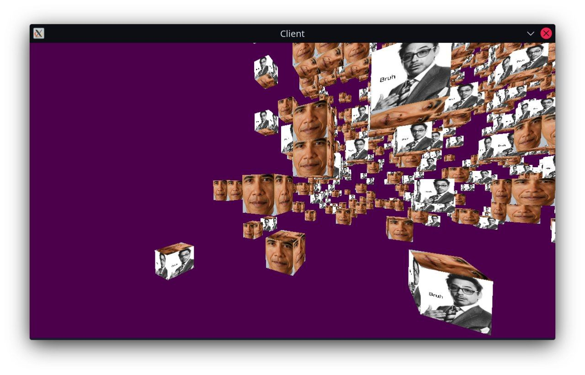
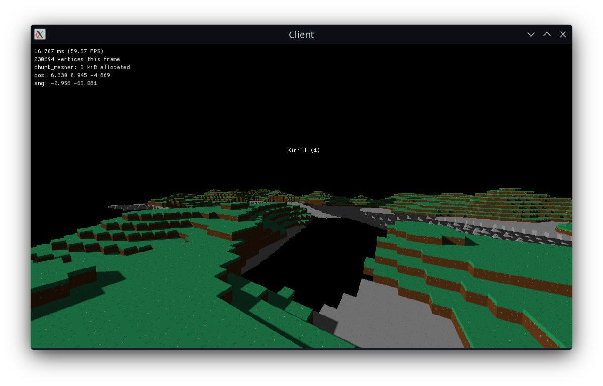
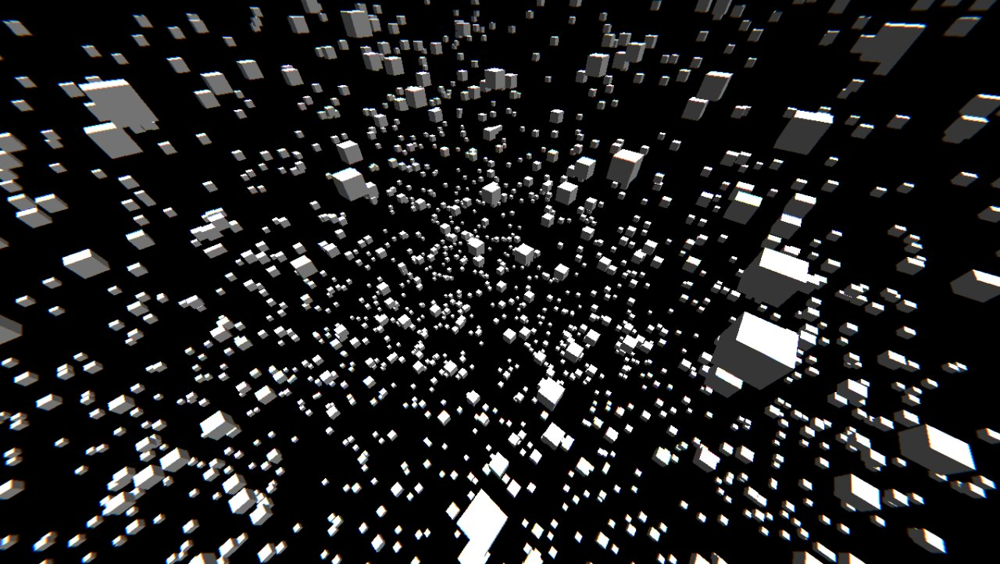
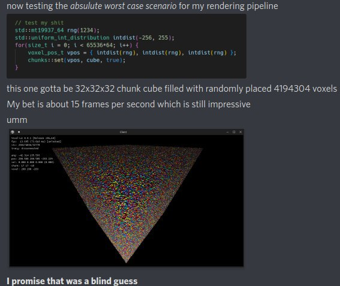
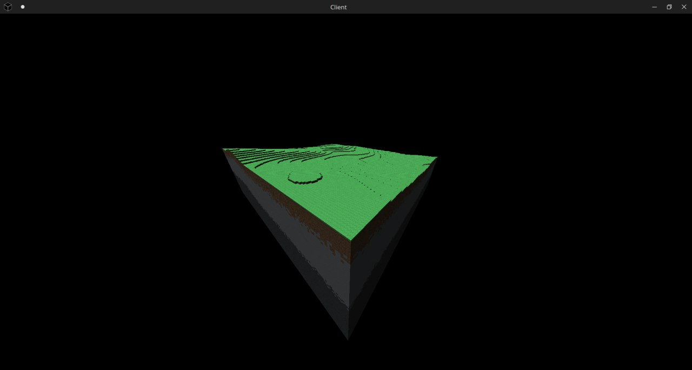
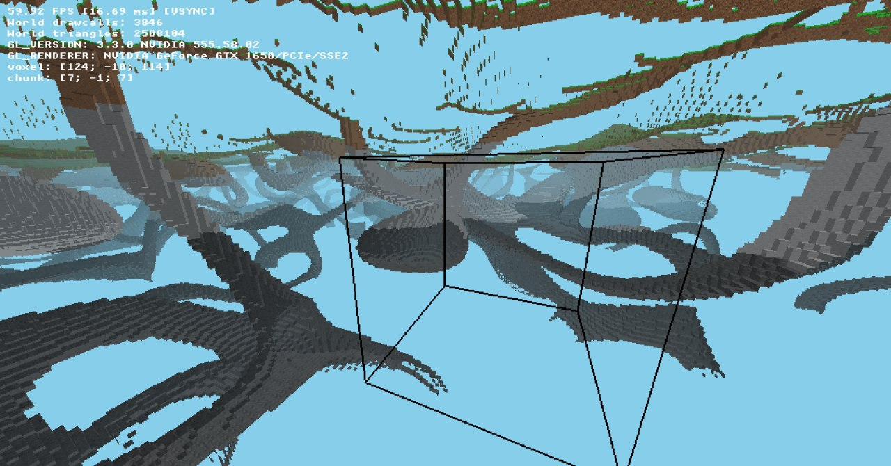
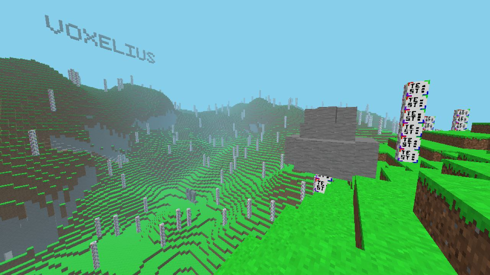
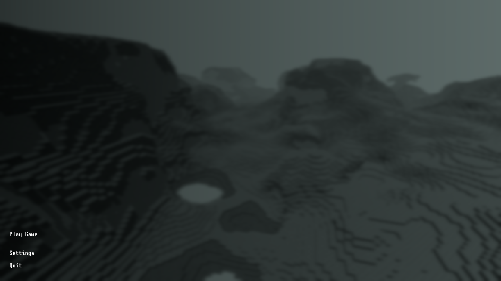
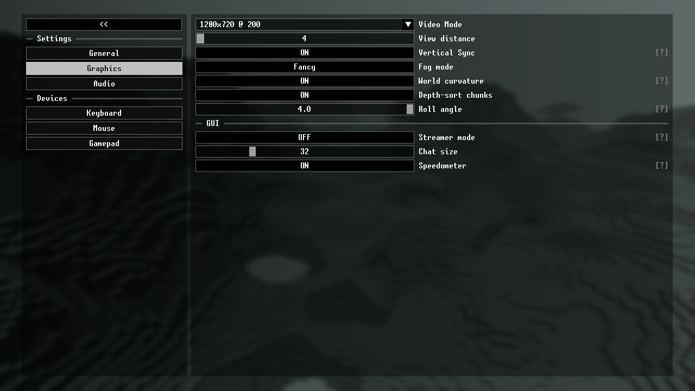
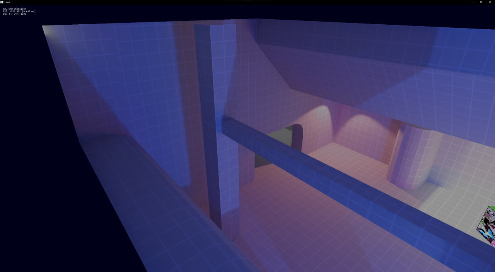

# Overview: history

Voxelius as a concept dates way back to 2021 when grass was greener and skies were less poluted with fiber optic  

## 2021: it wasn't always a voxel-ius

Because I had nothing else to do during lockdown and lecture times at University, I decided to do a little bit of experimenting with OpenGL 4.6 and C++17; the idea was to see if having objects be drawn using a single draw-call and then their contents be figured out in a fragment shader, was feasible.  

What came out of it was a simple 2D engine that used Box2D for physics, was capable of playing .xm modules (without streaming) and had the world be rendered in literally four draw-calls...

  

  

  

## 2021: voxelius historic

At this point I got my voxel itch again (and if you know me, I readlly started to get interested in voxels in about late 2020) and decided to strip the source code from 2D rendering and start from scratch.  

I first defined some structures and made a basic rendering implementation that only drew colored voxels with a specific color assigned to each side of it, here's the image:  

  

> As a matter of fact, this is _the first_ ever image captured of Voxelius rendering anything. It was made in RenderDoc and was originally placed in the repository's root, named `rd0.png`. Funnily enough, the first ever image finds its way into whatever web and installer media associated with the game, it's something of a tradition at this point :D  

Then came textures, the choice of which was quite unorthodox but that's what I had lying around on my drive at the moment:  

  
  

Eventually, stuff like greedy meshing, shadows and a rudimentary networking was implemented, but at that point the code became practically unmaintainable...  

  
  

  

## 2022-2023: voxelius modern

Nothing particular, just some performance improvements, better threading and a whole lot of doing nothing because 2022 was a hard on the IRL side ot things; although some experimental world generation was added later...  

 
 
 

## 2024-2025: large progress

> Funnily enough, in 2024, Voxelius as a project landed me my current software development job because it impressed the lead programmer at the company. I guess hobby projects sometimes pay off in the long term...  

Lots of major strides have been made in this period of time, including voxel interactions (break/place), decent world generation, feature placement, multiplayer and an actually decent-to-use GUI!  

  
  
  
  
  
  
  
  

  

## 2026: QFengine and SDL3_GPU

I became interested in SDL3's GPU API that abstracts away from Vulkan, Metal and D3D12 and acts as a lower-level OpenGL, and the project that actually grew out of it was my attempt at a quake-like engine (I'm willing to get back to it later) that looks like this:  

  

  
  

So it wasn't unexpected for me to want to use SDL3_GPU in Voxelius, however...  

## 2026: the third rewrite

Current version of Voxelius heavily relies on OpenGL, which is quite incompatible with SDL3_GPU. I also started using Eigen for vector maths and some other things improved in my skills to the point I decided I want a rewrite.  

Apart from SDL3_GPU, I want the new rewrite to base upon concepts defined by Minetest/Luanti and have game content defined by Lua scripts whilst core gameplay is defined in C++ code.  
