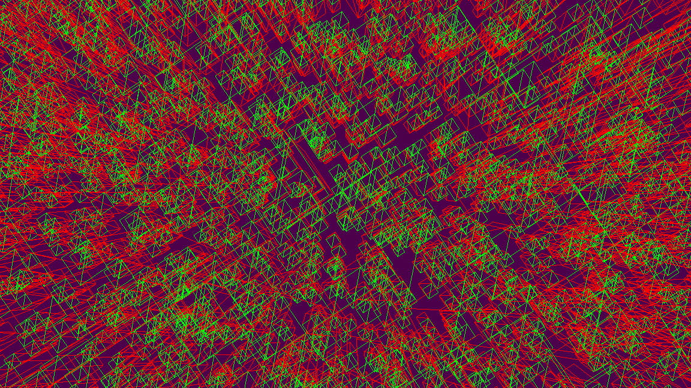
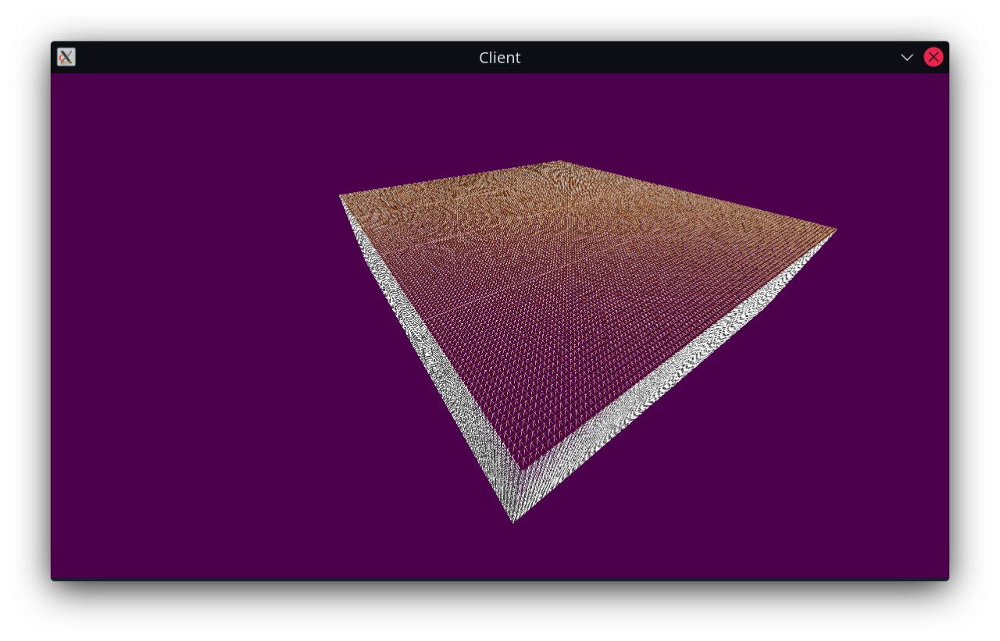
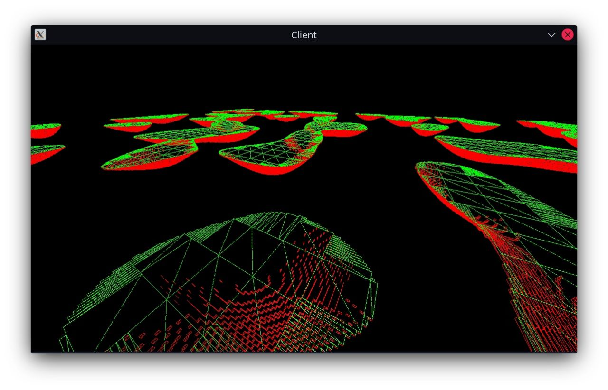
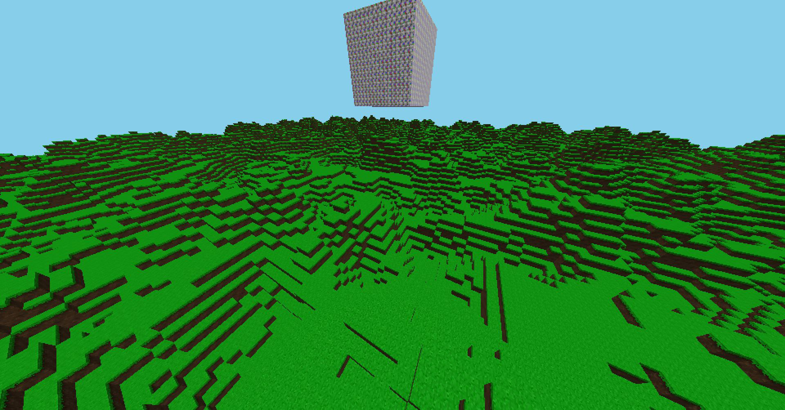
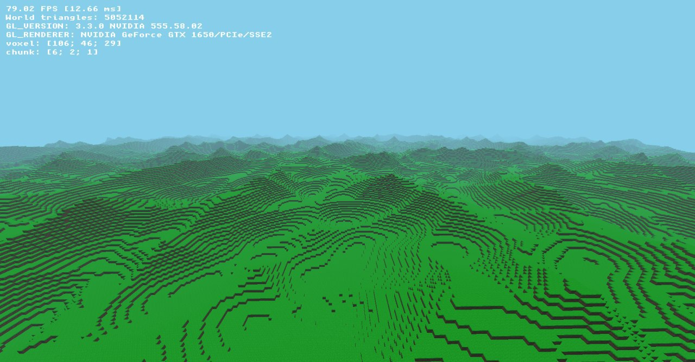
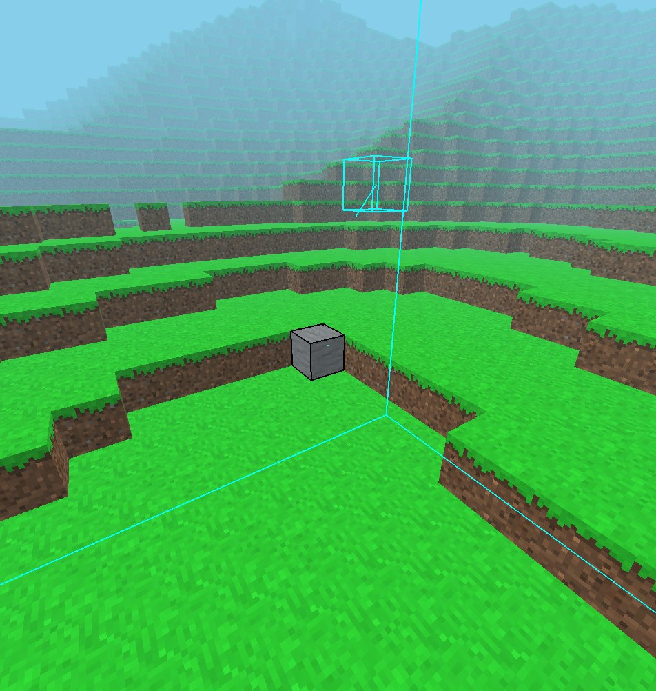
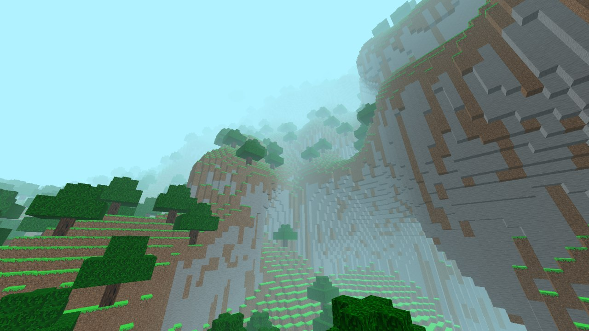
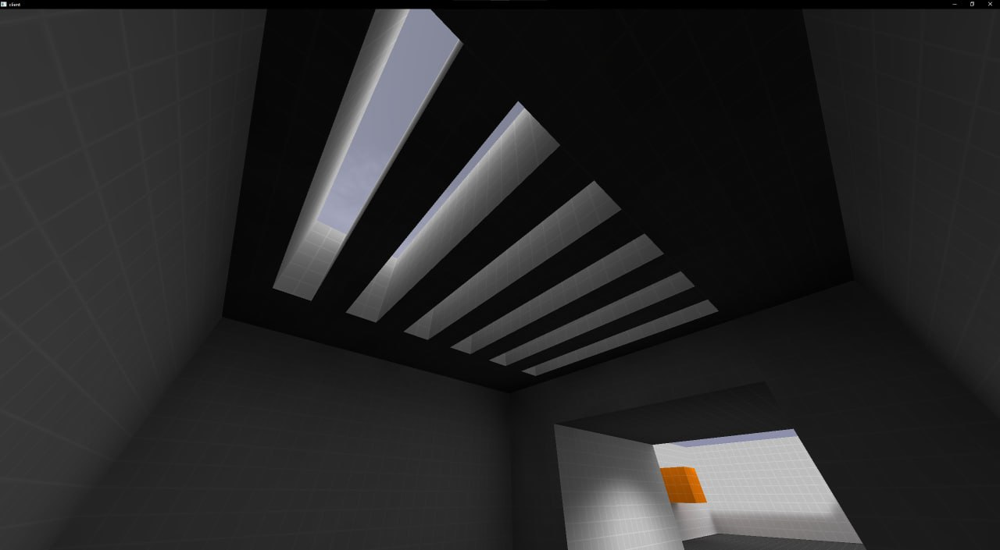
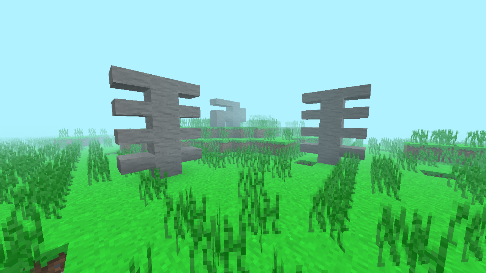

# About: history

Voxelius as a concept dates back to 2021.

## 2021: it was not always a voxel-ius

I had nothing else to do during lockdown and lecture times at university. I started experimenting with OpenGL 4.6 and C++17. The idea was to draw objects with a single draw call and figure out their contents in a fragment shader.

What came out was a simple 2D engine. It used Box2D for physics, could play .xm modules (without streaming), and rendered the world in four draw calls.

## 2021: voxelius historic

Then the voxel itch came back. I stripped the 2D rendering and started from scratch.

I first defined some structures and made a basic renderer. It only drew colored voxels, with a color per side:

> This is the first image captured of Voxelius rendering anything. I made it in RenderDoc and originally placed it in the repository root as `rd0.png`. That first image still appears in web and installer media. It is something of a tradition at this point.

Then came textures. The choice was unorthodox, but that is what I had on my drive:

Eventually greedy meshing, shadows, and rudimentary networking landed. By then the code was practically unmaintainable.

## 2022-2023: voxelius modern

Nothing particular. Some performance work, better threading, and a lot of doing nothing because 2022 was hard on the IRL side of things. Some experimental world generation showed up later.

## 2024-2025: large progress

> In 2024 Voxelius landed me my current software job because it impressed the lead programmer. Hobby projects sometimes pay off.

This period brought voxel interactions (break/place), decent world generation, feature placement, multiplayer, and a GUI that was usable.

## 2026: QFengine

I got interested in SDL3's GPU API. It abstracts Vulkan, Metal, and D3D12 and acts like a lower-level OpenGL. Out of that came an attempt at a quake-like engine (I still want to get back to it later). It looks like this:

While doing that I figured out practices that made the source tree much better organised. Bringing those into Voxelius was an obvious next step. However...

## 2026: the third rewrite

The current public version of Voxelius leans hard on libraries and tools I no longer use. Examples: GLM (I use Eigen now), spdlog (I use my own simpler logging library from a work project), GLFW (I use SDL3 now). The list goes on. A straight port of the old code onto the new stack is not feasible.

I also wanted password-less player authentication. I already had a sort-of test project for Ed25519 auth called Prospero, and I want to reuse that approach in Voxelius.

Finally, I want the rewrite to follow ideas from the core inspiration, [OpenBuilder](https://github.com/Hopson97/open-builder) and Minetest/Luanti (or whatever they rename it to in two years). Game content should be defined through Lua, while core gameplay and world generation stay in C++.

