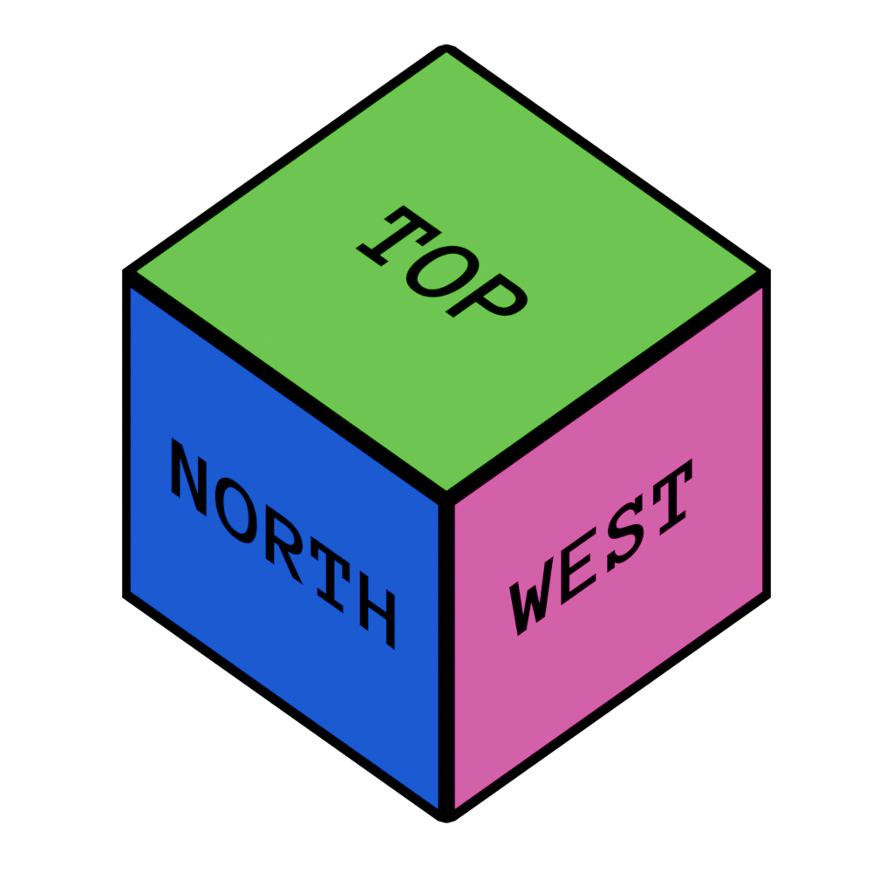
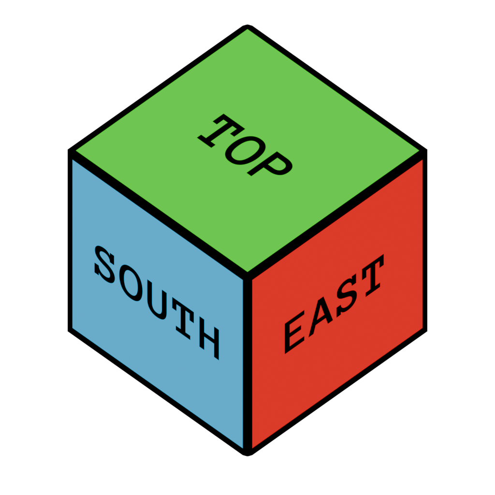
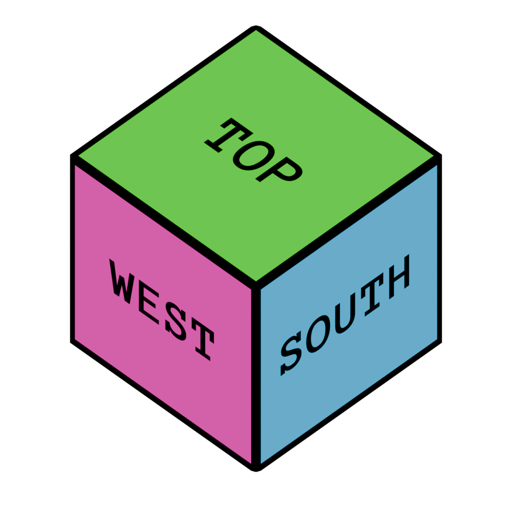
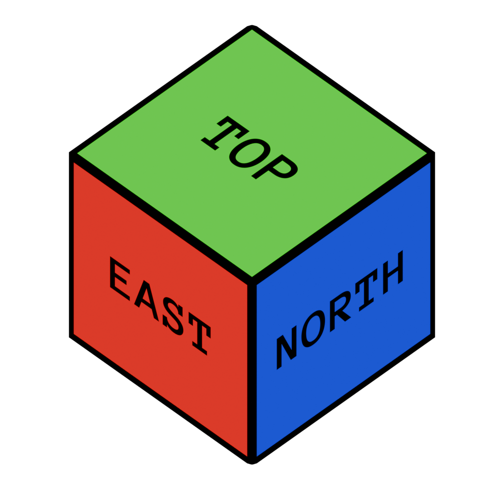
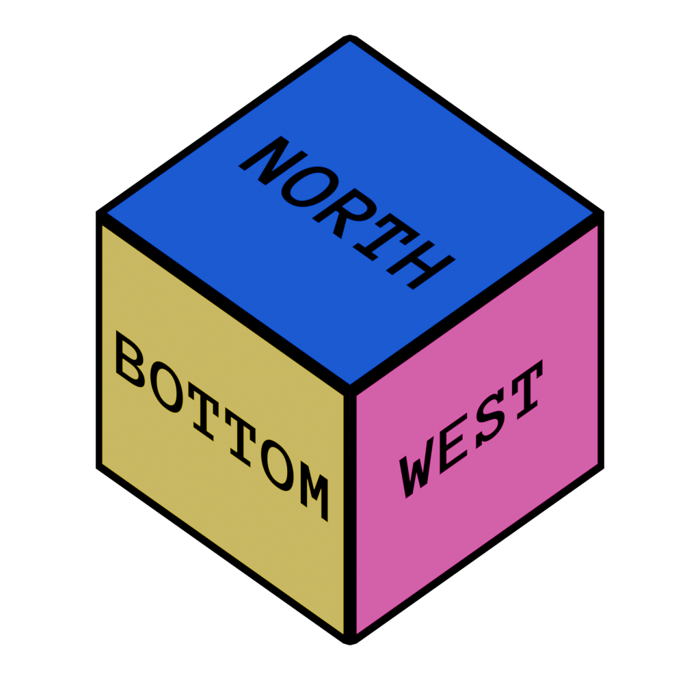
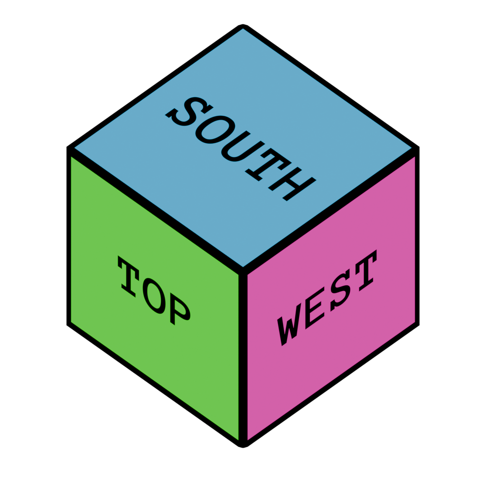

# Blocks API

Mods register new block types and read existing ones through the `blocks` library.

## Constants: render mode

Defines a block rendering step.

|Name|Description|
|----|----|
|`blocks.RENDER_NONE`|Block is not rendered (eg. air)|
|`blocks.RENDER_SOLID`|Block is rendered as opaque, cullable geometry|
|`blocks.RENDER_ALPHA`|Block is rendered as translucent geometry|

## Constants: block face

Defines a block face used for culling and other grid-aligned operations.

|Name|Description|
|----|----|
|`blocks.FACE_NORTH`|North face|
|`blocks.FACE_SOUTH`|South face|
|`blocks.FACE_EAST`|East face|
|`blocks.FACE_WEST`|West face|
|`blocks.FACE_TOP`|Top or upper face|
|`blocks.FACE_BOTTOM`|Bottom or lower face|
|`blocks.FACE_UP`|Same as `blocks.FACE_TOP`|
|`blocks.FACE_DOWN`|Same as `blocks.FACE_BOTTOM`|

## Constants: tool conditionals

Defines a tool category used for block interactions.

|Name|Description|
|----|----|
|`blocks.TOOL_NONE`|Bare hands|
|`blocks.TOOL_BLADE`|A bladed tool (eg. sword, knife)|
|`blocks.TOOL_XBLADE`|A multi-bladed tool (eg. scissors)|
|`blocks.TOOL_AXE`|Axe-like tool|
|`blocks.TOOL_HOE`|Hoe-like tool|
|`blocks.TOOL_SHOVEL`|Shovel-like tool|
|`blocks.TOOL_HAMMER`|Hammer-like tool|
|`blocks.TOOL_PICK`|Pickaxe-like tool|

## Constants: touch responses

Defines a touch response for a block.

|Name|Description|
|----|----|
|`blocks.TOUCH_NONE`|Block is not collidable|
|`blocks.TOUCH_SOLID`|Movement stops in the touch direction|
|`blocks.TOUCH_BOUNCE`|Movement is reflected with some attenuation. Reserved for future use (e.g. slime-like blocks). No builtin block uses it yet|
|`blocks.TOUCH_THROUGH`|Movement is attenuated but direction is unchanged. Reserved for future use (e.g. cobweb, liquids). No builtin block uses it yet|

## Constants: category bits

Freeform grouping tags checked at runtime with `blocks.has_tag`. Any block can carry any number of tags via the `tags` registration field.

|Name|Description|
|----|----|
|`blocks.TAG_GAS`|Non-solid, passable block (eg. air)|
|`blocks.TAG_ROCK`|Stone-family block. Used by tools and worldgen that check for rock|
|`blocks.TAG_SOIL`|Soil-type block. Dirt, mud, and similar blocks go here|
|`blocks.TAG_TURF`|Turf-type block. Grass and similar blocks go here|
|`blocks.TAG_XFOIL`|Non-solid foliage: grass, bushes, and similar|
|`blocks.TAG_SFOIL`|Solid foliage: leaves and similar|
|`blocks.TAG_WOOD`|Wooden blocks|

## Constants: schedule source

A scheduled tick is issued non-randomly with a specific timeout. Scheduled ticks can come from different sources.

|Name|Description|
|----|----|
|`blocks.TICK_RANDOM`|Random tick|
|`blocks.TICK_NEIGHBOUR`|Neighbouring block changed|
|`blocks.TICK_SCRIPTED`|Scripted tick|

## Constant: null block

`blocks.NULL_BLOCK` is an empty, undefined, or otherwise invalid block ID. Treat it as a void block for gameplay and gamedev.

## Functions

### Function: `blocks.get(name) -> integer`

Retrieve a numeric block stem ID from a namespaced block ID.

#### Arguments

- `name` is a namespaced block ID, eg. `mymod:coolblockname`

#### Return value

- Numeric block ID on success
- `blocks.NULL_BLOCK` if the block is missing or the namespace ID is malformed

#### Notes

- If a block defines states and variants, the return value is a _stem_ ID. A stem placed in the world is not rendered, not collidable, and not raycastable.

### Function: `blocks.has_tag(id, tag) -> boolean`

Check if a block has a specified tag.

#### Arguments

- `id` is a numeric block ID
- `tag` is a tag constant, eg. `blocks.TAG_SOIL`

#### Return value

- `true` if the block has the specified tag, `false` otherwise

### Function: `blocks.is_replaceable(id) -> boolean`

Check if a block ID can be overwritten without breaking it first (empty cell or `replaceable = true` at registration).

#### Arguments

- `id` is a numeric block ID (stem or variant), or `blocks.NULL_BLOCK` for an empty cell

#### Return value

- `true` if another block may occupy the cell, `false` otherwise

### Function: `blocks.add(name, def) -> integer`
### Function: `blocks.add(name, prototype, def) -> integer`

Register a new block in the registry.

#### Arguments

- `name` is a namespaced block ID, eg `mymod:coolblockname`
- `def` is a block definition table (see below)
- `prototype` (3-argument form) is a base definition shared across a family of blocks (eg. all stone variants). `def` merges on top. Fields in `def` win on conflict.

#### Return value

Returns the numeric block ID.

#### Notes

**Rename rule:** on conflict, the encroaching `name` gets a `~N` suffix. `N` is the smallest integer starting at `1` that yields a free id (e.g. `mymod:myblock~1`). Loading stays deterministic for the same mod list and order.

## Block definition

|Field|Type|Required|Default|Description|
|----|----|----|----|----|
|`render`|`integer`|yes|N/D|One of `blocks.RENDER_XXXX` constants|
|`albedo`|`table`|depends|`{}`|Albedo textures to attach to the block model|
|`masks`|`table`|no|`{}`|Mask textures to attach to the block model|
|`animated`|`boolean`|no|`false`|If true, textures in `textures` are animation frames instead of world-position random frames|
|`model_name`|`string`|depends|N/D|[Block model](format-bmodel.md) name for this variant|
|`model_offset`|`number[3]`|depends|`{0, 0, 0}`|Offset of the resolved block model|
|`model_facing`|`integer`|no|`blocks.FACE_NORTH`|One of `blocks.FACE_XXXX`. Sets where the model's own north face points. Rotates the whole resolved block model|
|`bcoll_name`|`string`|depends|N/D|[Block collision](format-bcoll.md) shape for this variant|
|`bcoll_offset`|`number[3]`|depends|`{0, 0, 0}`|Block collision offset|
|`bcoll_facing`|`integer`|no|`blocks.FACE_NORTH`|One of `blocks.FACE_XXXX`. Rotates the resolved collision shape the same way `model_facing` rotates the model. Set independently. Collision need not match the visual, though it usually should|
|`fluid_name`|`string`|no|N/D|[Fluid](api-fluids.md) name that shares the grid cell with the block|
|`fluid_level`|`integer`|no|0|Fluid level if `fluid_name` is set, in 1/16ths of a block|
|`health`|`integer`|no|`0`|Base hit points needed to break the block. Tool effects can change this|
|`sound`|`string`|no|N/D|Sound set for this block|
|`emission`|`integer`|no|`0`|Emission light value|
|`dissipation`|`integer`|no|`0`|How much light the block absorbs as light passes through|
|`touch`|`integer`|no|`blocks.TOUCH_SOLID`|Block touch response|
|`touch_coeffs`|`number[3]`|no|`{1, 1, 1}`|Block touch response coefficients|
|`tags`|`integer[]`|no|`{}`|Block tags|
|`replaceable`|`boolean`|no|`false`|If true, other blocks can be placed into this cell without breaking it first|
|`states`|`table`|no|`{}`|Blockstates table|
|`variants`|`table[]`|no|`{}`|Variants table|
|`on_tick`|`function`|no|`nil`|Scheduled tick handler|
|`on_place`|`function`|no|`nil`|Placement handler. Can allow or deny placement|
|`on_break`|`function`|no|`nil`|Break handler|
|`on_interact`|`function`|no|`nil`|Interaction handler|

### Textures

#### Albedo

Each texture slot is a list of textures. The engine uses them as position-randomized variations, or as animation frames when `animated` is `true`.

#### Masks

Each texture slot can have a mask texture used by the engine for certain purposes. Each color channel of an RGBA mask texture can (and will in the future) drive per-face logic.

|Channel|Designation|Description|
|----|----|----|
|Red|Tint mask|Actual tint color is multiplied with this value in shaders|
|Green|Unused|N/A|
|Blue|Unused|N/A|
|Alpha|Unused|N/A|

### Facing rotation

`model_facing` and `bcoll_facing` each define one 90-degree-step rotation of the whole model or collision shape. They set where the north face of the model points. By default it points world north.

|Value|Rotation|Image|
|----|----|----|
|`blocks.FACE_NORTH`|None||
|`blocks.FACE_SOUTH`|180 degrees around Y||
|`blocks.FACE_EAST`|+90 degrees around Y||
|`blocks.FACE_WEST`|-90 degrees around Y||
|`blocks.FACE_TOP`|-90 degrees around X||
|`blocks.FACE_BOTTOM`|+90 degrees around X||

### Drops table

```lua
drops = {
  {
    when = { effects = { "silk_touch" } },
    items = {
      { name = "stone", count = 1 }
    }
  },
  {
    -- entries without a `when` always match; put fallback
    -- entries last since matching stops at the first hit
    items = {
      { name = "cobblestone", count = 1 }
    }
  }
}
```

Entries are evaluated top to bottom. The first entry whose `when` clause matches (or that has no `when`) supplies the drops. Later entries are ignored.

### States table

```lua
states = {
  <state_name> = {
    default = "<default_state>",
    hint = { "<value_a>", "<value_b>", ... }  -- optional
  }
}
```

Blockstate values are hashed strings. Any value can be written via `world.sset`. `hint` does not restrict this at runtime. `hint` is only a registration-time cross-check. Every `when` clause across the `variants` of this block is checked against the union of `hint` lists for the states it references. A value missing from `hint` produces a console warning at load time (typo protection, e.g. `orientation = "bottum"`). Blocks that omit `hint` for a state skip validation for that state.

### State object

|Field|Type|Required|Default|Description|
|----|----|----|----|----|
|`default`|`string`|yes|N/D|Default blockstate value|
|`hint`|`string[]`|no|`{}`|Optional list of valid values for registration-time validation|

### Variants

```lua
variants = {
  {
    when = { <state_name> = "<state_value>" },
    overrides = {
      model_name = "slab_top",
      bcoll_offset = { 0, 8, 0 },
      health = 2,
      replaceable = true,
      drops = { ... }
    }
  }
}
```

`overrides` is a table of registration fields (same shape as the top-level definition). It merges on top of the base definition of the block when `when` matches the current blockstate values.

### Target table

Some callbacks pass a `target` table for the block the initiator looked at (the raycast hit). In `on_place`, this is the block adjacent to the placement cell.

|Field|Type|Description|
|----|----|----|
|`stem`|`integer`|Numeric block stem ID of the hit block|
|`face`|`integer`|Hit surface direction|
|`ni`|`number`|Surface normal X/I component|
|`nj`|`number`|Surface normal Y/J component|
|`nk`|`number`|Surface normal Z/K component|
|`lx`|`number`|Hit point X component|
|`ly`|`number`|Hit point Y component|
|`lz`|`number`|Hit point Z component|
|`bx`|`integer`|Hit block position X component|
|`by`|`integer`|Hit block position Y component|
|`bz`|`integer`|Hit block position Z component|
|`rx`|`number`|Block-local hit position X component|
|`ry`|`number`|Block-local hit position Y component|
|`rz`|`number`|Block-local hit position Z component|

### Occupant table

The `on_place` handler receives an `occupant` table for the block currently in the placement cell.

|Field|Type|Description|
|----|----|----|
|`id`|`integer`|Numeric block ID in the placement cell. `blocks.NULL_BLOCK` when empty|
|`replaceable`|`boolean`|Whether the placement cell can be occupied: `true` when empty or when the existing block was registered with `replaceable`. `false` otherwise|

### `on_place` handler

```lua
on_place = function(bx, by, bz, target, occupant, actor)
  if not occupant.replaceable then
    return nil -- cell is occupied by a non-replaceable block
  end

  -- permits placement with these initial states
  return { <state_name> = "<state_value>", ... }
end
```

Returning `nil` blocks placement. Returning a table (empty or not) permits it. Table entries become initial blockstate values for states not covered by their `default`.

When placement is permitted, the new block overwrites whatever was in the cell. Replaceable occupants are not broken and do not drop items.

### `on_break` handler

```lua
on_break = function(bx, by, bz, actor)
  -- Actions to do before the block is broken
end
```

### `on_interact` handler

```lua
on_interact = function(bx, by, bz, target, actor)
  -- Actions to do when someone interacts with the block
end
```

### `on_tick` handler

```lua
on_tick = function(bx, by, bz, source)
  -- Actions to do when the block is ticked via scheduling
  -- source is one of blocks.TICK_XXXX constants
end
```
