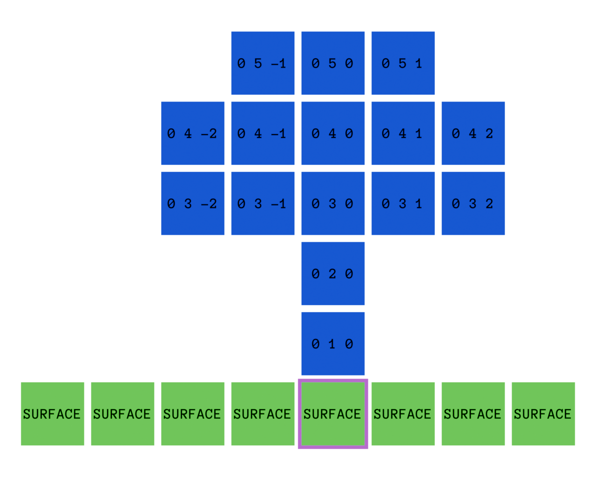
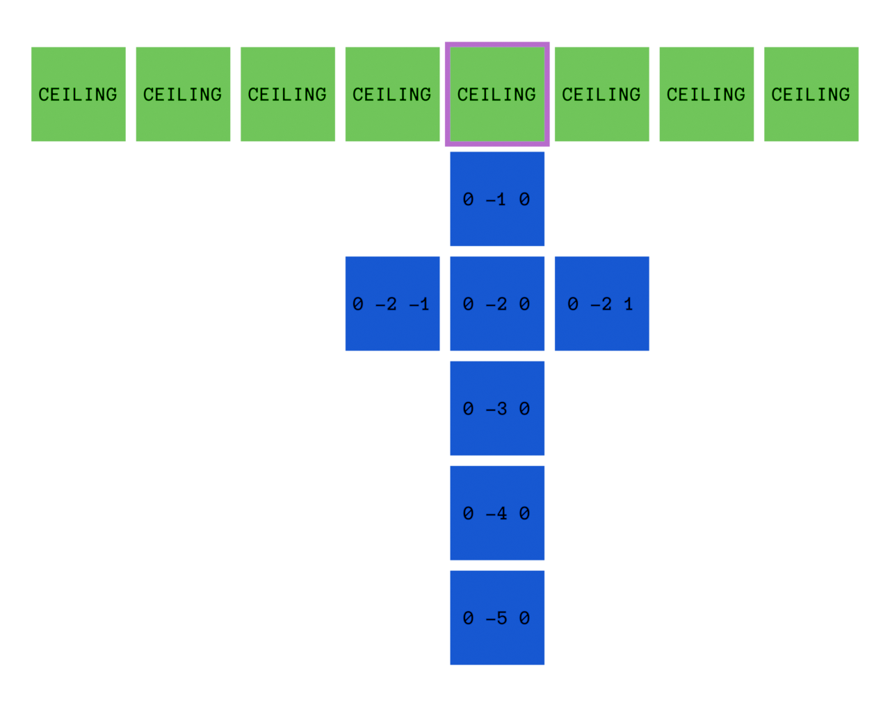
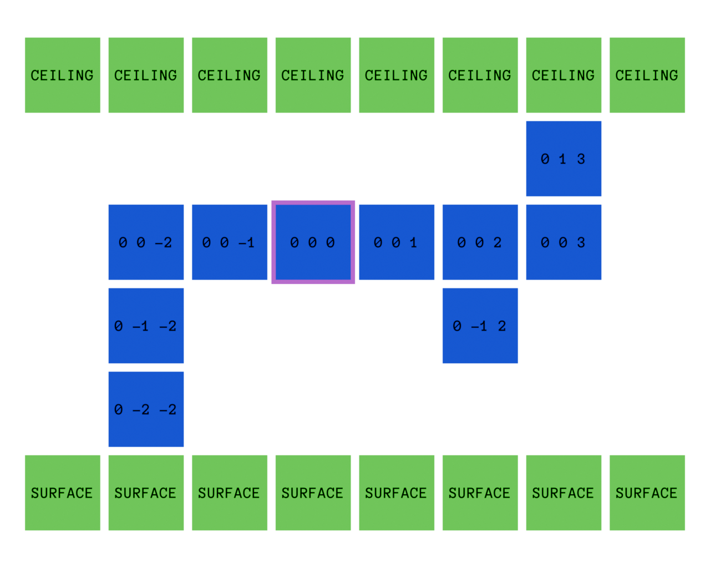

# Features

A feature is a terrain generation primitive. It adds randomness to the world and can improve gameplay. Features can be assigned to biomes for random scatter. Placing features from scripts is planned.

Stored features live under: `namespace:features`

## Top-level fields

|Field|Type|Required|Default|Description|
|----|----|----|----|----|
|`anchor`|`string`|yes|N/D|Feature anchor|
|`palette`|`object[]`|no|`[]`|Block palette to use|
|`parts`|`object[]`|yes|N/D|Feature parts|

### Anchor values

Features have a starting point. That point must be anchored. The engine provides three anchor modes:

|Name|Description|Image|
|----|----|----|
|`"surface"`|Feature origin is a surface block (eg. grass)||
|`"ceiling"`|Feature origin is a ceiling block (eg. a cave ceiling)||
|`"whatever"`|Feature is placed wherever the game decides is a good spot||

## Palette entries

```json
"palette": [
  {
    "block": "builtin:stone_slab",
    "states": {
      "orientation": "bottom"
    }
  },
  {
    "block": "bultin:stone_slab",
    "states": {
      "orientation": "top"
    }
  },
  {
    "block": "builtin:grass"
  }
]
```

|Field|Type|Required|Default|Description|
|----|----|----|----|----|
|`block`|`string`|yes|N/D|Namespaced block ID|
|`states`|`object`|no|`{}`|Blockstate key-values|

## Parts entries

```json
"parts": [
  {
    "block": 0,
    "offset": [0, 1, 0],
    "overwrite": ["gas", "foil"]
  }
]
```

|Field|Type|Required|Default|Description|
|----|----|----|----|----|
|`block`|`integer`|yes|N/D|Palette entry index|
|`offset`|`integer[3]`|yes|N/D|Offset in blocks from the origin point|
|`overwrite`|`string[]`|no|`{}`|Block tags the feature can overwrite when they occupy the needed space|

### Tag values

|JSON|Lua constant|
|----|----|
|`"gas"`|`blocks.TAG_GAS`|
|`"rock"`|`blocks.TAG_ROCK`|
|`"soil"`|`blocks.TAG_SOIL`|
|`"turf"`|`blocks.TAG_TURF`|
|`"foil"`|`blocks.TAG_FOIL`|
|`"wood"`|`blocks.TAG_WOOD`|
